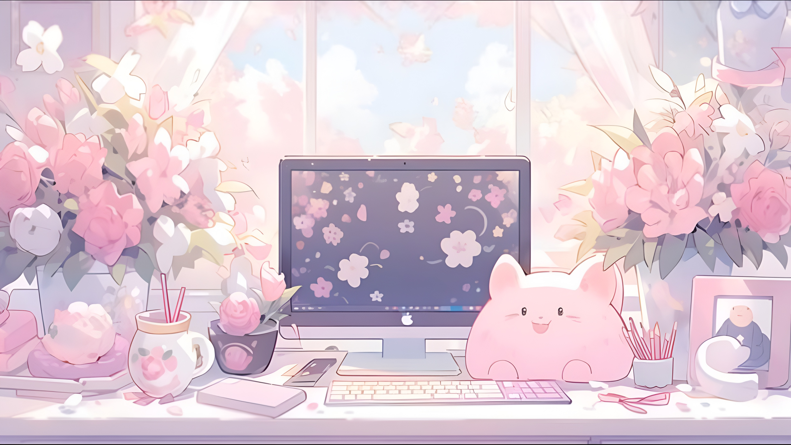

<!-- 🌸 Banner Sakura -->

  

<!-- 🌸 Typing Effect -->

  

---

<h2 align="center">🌸 Blooming FullStack Developer 🌸</h2>

Coding while chasing cherry blossom dreams ✨

---

## 🌸 About Me

  
  
👩‍💻 Exploring code like petals in the wind   

🌱 Growing step by step on my Full-Stack journey   

🤝 Excited to learn, share, and collaborate 

🌸 Fun fact: I mix creativity + logic like sakura tea & matcha latte 🍵  

---

## 🌸 Tech & Tools 🌸

  <!-- 🌸 Languages -->
  
  
  
  
  
  
  <!-- 🌸 Frontend -->
  
  
  
  

  <!-- 🌸 Backend -->
  
  
  

  <!-- 🌸 Database -->
  

  <!-- 🌸 Tools -->
  
  
  
  

---

## 🌸 GitHub Stats

 
  

  
  
  

---

## 🌸 Fun Corner
🍵 Tea before code  
🎮 Gaming: Genshin, Star Rail, Minecraft  
🐾 Powered by cats & code   
🎶 Lofi + Anime OST when coding  

---

<!-- 🌸 Sakura Divider -->

  ✦･ﾟ: *✧･ﾟ:* 💻 petals of logic, roots of creativity 🌸 *:･ﾟ✧*:･ﾟ✦

────────────── ⋆⋅☆⋅⋆ ──────────────

🌸 ありがとう for visiting my profile 🌸

  

